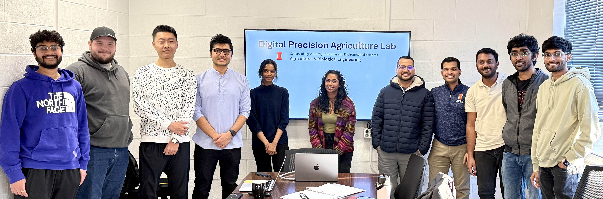

<!-- 

### Assistant Professor (Digital Precision Agriculture)  
[Agricultural and Biological Engineering](https://abe.illinois.edu/directory/sunoj),  
University of Illinois Urbana-Champaign, Urbana, IL 61801.  
Email: sunoj[at]illinois.edu  

#             -->

<!-- [Sunoj Shajahan CV](SunojCV_October10_2022.pdf) -->

# Welcome to the Digital Precision Agriculture Lab!  

I am an Assistant Professor in the [Department of Agricultural and Biological Engineering](https://abe.illinois.edu/) at the University of Illinois Urbana-Champaign, where I specialize in **Computational Engineering for Digital Precision Agriculture**. My research focuses on harnessing **advanced data analytics** and **AI algorithms**—ranging from simple models to state-of-the-art (SOTA) techniques—to process and interpret multi-source sensor data. These data streams include:  
- **Remotely sensed imagery** (leveraging free and open-access platforms),  
- **Robotics sensing data** (collected using the Farm-ng Amiga platform), and  
- **Machine sensing** (from vision cameras mounted on agricultural equipment).  

I am dedicated to developing **data-driven decision support tools** that empower farmers and stakeholders to make informed decisions ranging from seasonal management, understanding legacy effects, or enabling near real-time interventions. By bridging the gap between technology and agriculture, our work aims to create innovative, practical, and impactful solutions for agriculture.  

## Passion for Open-Source Innovation  

I am deeply passionate about leveraging **Free and Open-Source Software (FOSS)** platforms for geospatial data analysis and tool development. I design workflows for analyzing geospatial data and images using tools like **QGIS**, **R**, **ImageJ**, and **Python**. I firmly believe that the open-source culture promotes widespread access, fosters transparency, and ensures credibility and practicality for farmers and researchers alike.  

## Previous work and future directions  

In my previous research, I focused on predicting **field-scale corn yield** and mapping variability using **drone and satellite imagery**. Moving forward, I am excited to integrate additional data layers—such as **weather**, **topography**, and **equipment log data**—to deepen our understanding of crop growth dynamics throughout the growing season.  

---

Thank you for visiting! Explore our website to learn more about our **research areas**, meet our talented **team members**, and discover our **publications**, **awards**, and **events**. Together, we’re working toward a smarter, more sustainable future for agriculture.  

## Lab updates

+ March 2025: Our team is participating in the Farm Robotics Challenge 2025, organized by UCANR and Farm_ng.   