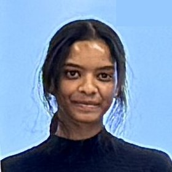
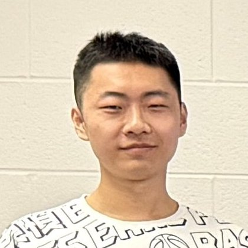
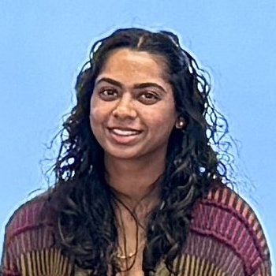

<!-- # Our team -->

## Principal Investigator

    
    

        <strong>Sunoj Shajahan </strong> 
        Assistant Professor   
        Sunoj is born and raised from India.   
        [sunoj@illinois.edu](mailto:sunoj@illinois.edu) | 
    

---
## Graduate students
<!-- ### Person 1 -->

    
    

        <strong>Lora Mohanty </strong> 
        Ph.D. student   
        Lora is originally from Bhuvaneshwar, India. She completed her M.Tech. in Agro Rural Studies at IIT Guwahati in 2024 and joined our team in Fall 2024.  
        [loram3@illinois.edu](mailto:loram3@illinois.edu) | 
    

---
<!-- Sandesh -->

    
    

        <strong>Sandesh Poudel </strong> 
        Ph.D. student   
        Sandesh is originally from Nepal. He completed his B.E. Agricultural Engineering, Tribhuvan University, Nepal, Nepal and pursued his M.S. Agricultural Engineering, University of Georgia, before joining our team in Spring 2025.  
        [spoudel2@illinois.edu](mailto:spoudel2@illinois.edu) | 
    

---

<!-- Zhang -->

    
    

        <strong>Xiaoyu Zhang </strong> 
        MS student   
        Zhang is originally from China. He completed his B.E. Agricultural Engineering, Tribhuvan University, Nepal, Nepal and pursued his M.S. Agricultural Engineering, University of Georgia, before joining our team in Spring 2025.  
        [spoudel2@illinois.edu](mailto:spoudel2@illinois.edu) | 
    

---

## Undergraduate students

    
    

        <strong>Hannah Surya Sundararajan </strong> 
        Junior, Agricultural and Biological Engineering   
        Hannah is from Wisconsin. She was   
        [sethtv2@illinois.edu](mailto:sethtv2@illinois.edu) | 
    

---

    
    

        <strong>Seth Van Hoveln </strong> 
        Senior, Engineering Technology Management in Agricultural Sciences   
        Seth is Milford, IL. He comes from a farm background and an expert in precision agriculture.  
        [sethtv2@illinois.edu](mailto:sethtv2@illinois.edu) | 
    

---
