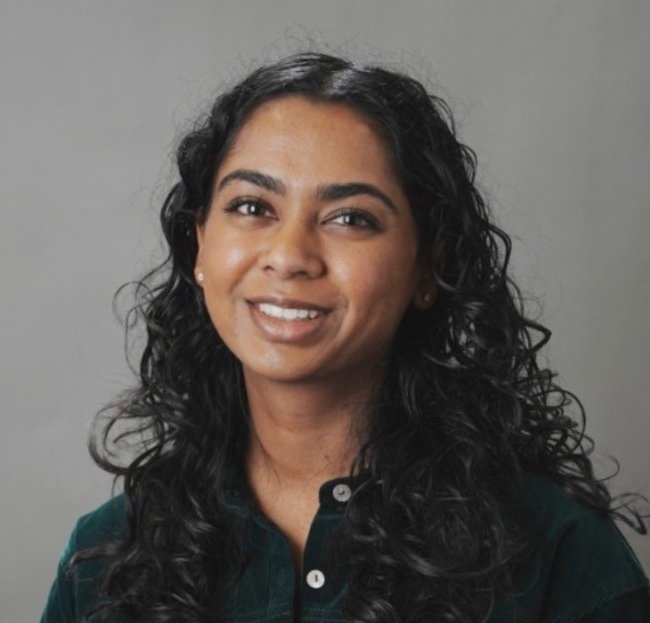

<!-- 
      Sunoj was born and raised in Tamil Nadu, India, where he completed his undergraduate and master’s studies at Tamil Nadu Agricultural University, Coimbatore. His interest in sensing and automation began during his master’s work with FT-NIR spectroscopy. During his PhD at North Dakota State University, he developed four software tools for processing field images using FOSS, ImageJ. As a postdoctoral associate at Cornell University, he worked on remote sensing and data analysis for crop yield prediction. Sunoj joined UIUC in Fall 2023, and started the Digital Precision Agriculture Lab, which focuses on developing AI-driven, geospatial solutions for data-driven agriculture and precision technologies.  -->

<!-- # Our team -->

## Principal Investigator

    
    

        <strong>Sunoj Shajahan </strong> 
        Assistant Professor   
        Sunoj was born and raised in Tamil Nadu, India. His interest for FOSS started during his PhD where he developed four software tools for processing field images using FOSS, ImageJ. Druing his period as a postdoctoral associate at Cornell University, he worked on remote sensing and data analysis for crop yield prediction. Sunoj joined UIUC in Fall 2023, and started the Digital Precision Agriculture Lab, which focuses on using precision technologies and developing data-driven practical and geospatial solutions for agriculture.  
        <a href="mailto:sunoj@illinois.edu">sunoj@illinois.edu</a> | <a href="https://www.linkedin.com/in/sunoj-shajahan-ph-d-23606190/" style="margin-left: 10px;"><i class="fab fa-linkedin"></i></a> | <a href="https://scholar.google.com/citations?user=PSu2s7YAAAAJ&hl=en" style="margin-left: 10px;"><i class="fa-brands fa-google-scholar"></i></a>
    

---

## Graduate students
<!-- Lora -->

    
    

        <strong>Lora Mohanty </strong> 
        Ph.D. student   
        Lora is from Bhubaneswar, India. She completed her M.Tech. in Agro Rural Studies at IIT Guwahati in 2024 and joined our team in Fall 2024.  
        <a href="mailto:loram3@illinois.edu">loram3@illinois.edu</a> | <a href="https://www.linkedin.com/in/lora-mohanty-aa4301249/" style="margin-left: 10px;"><i class="fab fa-linkedin"></i></a>  
    

---
<!-- Sandesh -->

    
    

        <strong>Sandesh Poudel </strong> 
        Ph.D. student   
        Sandesh is from Nepal. He completed his B.E. Agricultural Engineering, Tribhuvan University, Nepal, Nepal and pursued his M.S. Agricultural Engineering, University of Georgia, before joining our team in Spring 2025.  
        <a href="mailto:spoudel2@illinois.edu">spoudel2@illinois.edu</a> | <a href="https://www.linkedin.com/in/sandesh-poudel-733b59110/" style="margin-left: 10px;"><i class="fab fa-linkedin"></i></a> | <a href="https://scholar.google.com/citations?user=LH3_qT0AAAAJ&hl=en" style="margin-left: 10px;"><i class="fa-brands fa-google-scholar"></i></a>
    

---

<!-- Zhang -->

    
    

        <strong>Xiaoyu Zhang </strong> 
        MS student, ABE   
        Zhang is from China. His research interests are in satellite image analysis, geospatial analysis, and machine learning. His MS thesis focuses on “Generalizing yield prediction and identifying key factors to improve the accuracy of prediction.”   
        <a href="mailto:xiaoyu26@illinois.edu">xiaoyu26@illinois.edu</a>
    

---

<!-- Abhi -->

    
    

        <strong>Abhinav Pagadala </strong> 
        MS student, Statistics and Data Science   
        Abhi is from Manhattan, KS. He is part of the AIFARMS project on mechanical weeding project on horseradish. With his expertise, he is training and testing a few detection and segmentation models for navigation and weed removal. He is also finetuning certain models to make it light-weight and can run on smaller edge computing device.  
        <a href="mailto:asp14@illinois.edu">asp14@illinois.edu</a> | <a href="https://www.linkedin.com/in/abhinav-pagadala-5201bb231/" style="margin-left: 10px;"><i class="fab fa-linkedin"></i></a> 
    

---

<!-- Janmejay -->

    
    

        <strong>Janmejay Rathi </strong> 
        MS, Robotics and Autonomy   
        Janmejay is from Nagpur, India. He completed his B.E. in Computer Science and Engineering from Shri Ramdeobaba College of Engineering and Management, Nagpur and pursued his MS at UIUC. He graduated in Fall 2024 and joined our team as Robotics Engineer in Spring 2025. He is passionate about robotics and working on integrating components for a horseradish weeding project.  
        <a href="mailto:email@example.com">jurathi2@illinois.edu</a> | <a href="https://www.linkedin.com/in/janmejayrathi/" style="margin-left: 10px;"><i class="fab fa-linkedin"></i></a> 
    

---

## Undergraduate students

<!-- Hannah -->

    
    

        <strong>Hannah Surya Sundararajan </strong> 
        Junior, Agricultural and Biological Engineering   
        Hannah is from Greater Milwaukee, WI. She is pursuing a dual degree in Agricultural & Biological Engineering and Spanish at the University of Illinois Urbana-Champaign, minoring in Geography and Geographic Information Sciences. She was also enlisted for 4 years in the Air National Guard as an Engineering Technician. In Fall 2024, she was selected as a NASA DEVELOP intern.  
        <a href="mailto:hss5@illinois.edu">hss5@illinois.edu</a> | <a href="https://www.linkedin.com/in/hannah-sundararajan/" style="margin-left: 10px;"><i class="fab fa-linkedin"></i></a>
    

---

<!-- Seth -->

    
    

        <strong>Seth Van Hoveln </strong> 
        Senior, Engineering Technology Management in Agricultural Sciences   
        Seth is from Milford, IL. He comes from a farm background and an expert in precision agriculture. He will graduate in Spring 2025, and is intersted in pursuing a MS and joining our team as a graduate student in Fall 2025.  
        <a href="mailto:sethtv2@illinois.edu">sethtv2@illinois.edu</a>        
    

---

<!-- Jusjeev -->

    
    

        <strong>Jusjeev Bhurjee </strong> 
        Senior, Computer Science   
        Jusjeev is from Punjab, India. He has spent most of his time outside of India, pursuing his schooling in Argentina, and South Africa. He is involved in robotics project and has been developing an autonomous navigation algorithm for the Amiga platform.  
        <a href="mailto:bhurjee2@illinois.edu">bhurjee2@illinois.edu</a> | <a href="https://www.linkedin.com/in/jusjeevsingh/" style="margin-left: 10px;"><i class="fab fa-linkedin"></i></a>        
    

---

<!-- Advait -->

    
    

        <strong>Advait Talhayani </strong> 
        Sophomore, Computer Science   
        Adviat is from Mumbai, India. He works on a project focusing on developing a segmetation model for identifying corn ears from a video footage collected on a combine harvester.  
        <a href="mailto:advaitt3@illinois.edu">advaitt3@illinois.edu</a>        
    

---