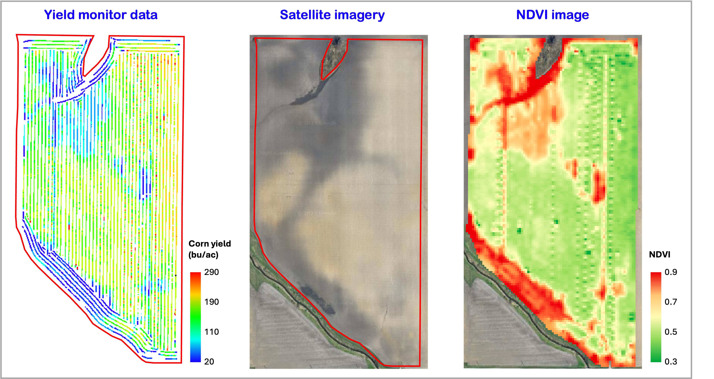

<!--  -->
# Current projects

### 1. Precision mechanical weeding on horseradish

Illinois has a rich history as a leading producer of horseradish, dating back 150 years. A persistent challenge in horseradish production is the lack of effective weed management solutions throughout the growing season. The application of post-emergent herbicides is restricted. Currently, weed control relies heavily on manual labor and tool implements that can only pull weeds taller than the crop. This project aims to develop AI vision-based weed control solutions explicitly tailored for horseradish producers, addressing the weed challenges they face. We are developing a mechanical weeding robot based on Farm-ng’s Amiga platform, integrating advanced technologies for improved weed management. Our approach comprises three stages: lane detection and autonomous navigation, weed detection through AI-based object detection, and an actuator mechanism for removing weeds between rows. 

**Students** 
+ [Sandesh Poudel](https://www.linkedin.com/in/sandesh-poudel-733b59110/), PhD student
+ [Dastan Rakhatov](https://www.linkedin.com/in/dastan-rakhatov-30b90bb4/), Visiting student
+ [Manan Maheshwari](https://www.linkedin.com/in/mananmaheshwari13/), MEng., Robotics & Autonomy
+ [Tanish Inamdar](https://www.linkedin.com/in/tanish-inamdar/), Undergraduate researcher, Computer Science

**Past students:** [Ken Chen](https://www.linkedin.com/in/ken-chen-412b731b6/); [Yudai Yamada](https://www.linkedin.com/in/%E9%9B%84%E5%A4%A7-%E5%B1%B1%E7%94%B0-659747252/); [Janmejay Rathi](https://www.linkedin.com/in/janmejayrathi/); [Pavankumar Dabilpuram](https://www.linkedin.com/in/pkd999/); [Paul Osuma](https://www.linkedin.com/in/paul-osuma-a47746139/); [Xinyuan Luo](https://www.linkedin.com/in/xinyuan-luo-a1b44428a/); [Yuhang Liu](https://www.linkedin.com/in/yuhang-liu-1aaa392b8/); [Benchy Detreuil](https://www.linkedin.com/in/benchydutreuil/); [Moises Rodriguez](https://www.linkedin.com/in/moises-rodriguez-9ba077258/); [Jusjeev Bhurjee](https://www.linkedin.com/in/jusjeevsingh/)

---

<!-- ### 2. Potential of Synthetic Aperture Radar (SAR) in agricultural applications

<!--  -->

<!-- Synthetic Aperture Radar (SAR) is a powerful yet underutilized tool in agricultural research. Sentinel-1A is a microwave remote sensing platform that provides high-resolution (10 m) imagery every five days. It offers all-weather, cloud-penetrating data in four bands (VV, HH, VH, HV). SAR measures surface backscatter properties, which can be used to study the impact of soil disturbances caused by various farming operations like tilling, planting, spraying, and harvesting in agriculture. This project will explore how temporal SAR data can be leveraged to analyze these surface changes, quantify soil properties such as moisture content, and assess erosion potential and topsoil depletion rates.  -->

<!-- **Students:** 
+ Xiaoyu Zhang, PhD student
+ Jinshang Fred Li, NASA UROP scholar, Summer 2025 -->

### 2. Generalized yield prediction using remote sensing

Crop yield prediction has been extensively studied for the past 4–5 decades, but developing a generalized approach remains a challenge. Models built for one region often fail to scale or adapt to other regions due to region-specific methodologies. Additionally, the impact of image and yield data resolution, as well as the influence of erroneous ground data on the transferability of prediction models, is underexplored. Most studies rely on ground truth data directly from combines, which often include yield data with delays of several seconds. The implications of using such erroneous data on yield prediction accuracy have not been adequately investigated. This research aims to examine the sources of variability in yield monitor data and assess how inaccuracies in yield data affect prediction models. It also addresses year-to-year variations to enhance model robustness and improve transferability across diverse agricultural regions.

**Students:** 
+ Xiaoyu Zhang, PhD student

---

### 3. Automated field boundary delineation

Field boundary delineation is a critical component of modern agricultural management, enabling farmers, researchers, and policymakers to make informed decisions based on accurate data. Field boundary delineation serves several essential cases of use within the agricultural landscape that include: (i) Tracking changes in field sizes over years; (ii) Detecting regional field shape variations; and (iii) Tracking crop rotations. Despite years of research, accurate field boundary delineation remains a challenge. The USDA’s recently released Crop Sequence Boundary (CSB) dataset, derived from the Cropland Data Layer, is freely available but it has low and coarse accuracy and rough edges, failing to capture finer field details visible in satellite imagery. There are a few research studies that showed AI-based delineation methods, reproducibility is limited due to unaccessible training data. Commercial products offer higher accuracy but are often expensive and inaccessible to researchers and smallholder farmers. Our proposed method addresses these limitations by using traditional image processing techniques that offer a simple, effective, and reproducible approach to field boundary delineation. 

**Students:** 
+ [Seth Van Hoveln](https://www.linkedin.com/in/seth-van-hoveln-933b80322/), Undergraduate researcher
+ [Jusjeev Bhurjee](https://www.linkedin.com/in/jusjeevsingh/), Undergraduate researcher (Fall 2024)

---
<!-- 5. FDK detection - Crop Science
6. CRW monitoring - Prairie Research Institute -->

